<!-- ===================================================== -->
<!-- A.R. JOSHUA JEBERSON — GitHub Profile README -->
<!-- ===================================================== -->

  

  

<h1 align="center">A.R. Joshua Jeberson</h1>

  <strong>Artificial Intelligence & Data Science | Python Developer | ML & Deep Learning</strong>

  
  
  
  
  
  

  

---

## 👋 About

I'm an **Artificial Intelligence and Data Science** student focused on building practical software and AI systems with Python.

My interests sit at the intersection of **machine learning, deep learning, computer vision, speech processing, APIs and backend development**. I prefer learning by building — taking an idea from a concept into a working application.

**Currently focused on:** AI/ML projects • Python development • Computer Vision • Data Science • Backend APIs

---

## 🧠 What I Build

| Area | What I work with |
| --- | --- |
| 🤖 **Artificial Intelligence** | Machine Learning, Deep Learning, model-based applications |
| 👁️ **Computer Vision** | OpenCV, image/video processing, visual AI |
| 🎙️ **Speech & Audio AI** | MFCC, LSTM/DNN, speech emotion recognition |
| 🐍 **Python Development** | Flask, REST APIs, automation and application development |
| 🛡️ **Security & Data** | NVD CVE API, vulnerability-data ingestion |
| 🗄️ **Data & SQL** | Data handling, SQL fundamentals and API-driven datasets |

---

## 🚀 Selected Projects

### 🛡️ DEEPSHIELD — Deepfake Detection System
An AI-focused project exploring **deepfake detection and media authenticity** using machine-learning/deep-learning concepts.

### 🎙️ Real-Time Speech Emotion Recognition
A speech AI system using **MFCC features, LSTM/DNN models, RAVDESS and TESS datasets**, designed for real-time emotion recognition.

### 📄 Question Paper Generator
A **Flask-based application** for generating question papers, combining Python backend development with structured question generation.

### 🔐 NVD CVE Data Project
A project built around the **National Vulnerability Database CVE API** for retrieving and working with vulnerability information.

<b>More projects</b>

- **MCQ Generator** — automated multiple-choice question generation
- **Voice Short Answer App** — voice-based short-answer interaction
- **Meesho Clone** — e-commerce web development project
- **Snake Game** — Python game development project

---

## 🧰 Technical Stack

  

  
  
  
  
  

---

## 📈 GitHub Activity

  
  

  

---

## 🐍 Contribution Activity

  

---

## 🤝 Let's Build Something

I'm interested in **AI, machine learning, Python development and practical technology projects**.

  <a href="https://www.linkedin.com/in/joshua-jeberson-a-r-ab8513366/"><b>LinkedIn</b></a>
  &nbsp; • &nbsp;
  <a href="https://github.com/Sparkjosh24"><b>GitHub</b></a>
  &nbsp; • &nbsp;
  <a href="https://drive.google.com/file/d/1cg2SqDapgJVUVaKol1-evIb0wdGkS_pd/view?usp=drivesdk"><b>Resume</b></a>
  &nbsp; • &nbsp;
  <a href="mailto:joshuajebersonar@gmail.com"><b>Email</b></a>

  <i>Build. Learn. Experiment. Improve.</i>

  

