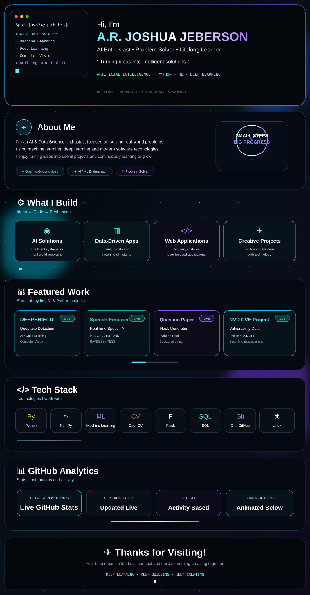

---

### Recruiter Quick View

- **Focus:** Artificial Intelligence, Machine Learning, Deep Learning, Computer Vision and Python
- **Featured work:** DEEPSHIELD, Speech Emotion Recognition, Question Paper Generator, NVD CVE project
- **Core tools:** Python, Java, C, Flask, OpenCV, NumPy, SQL, Git and Linux

