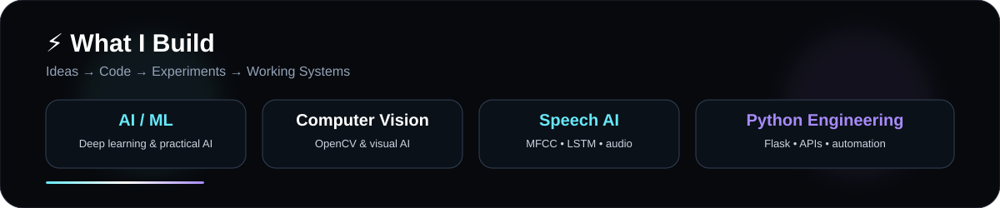
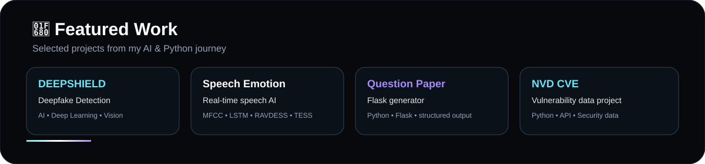
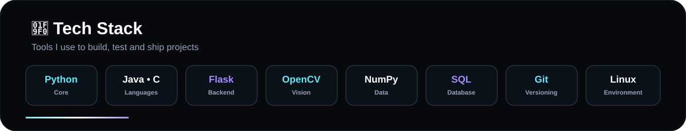
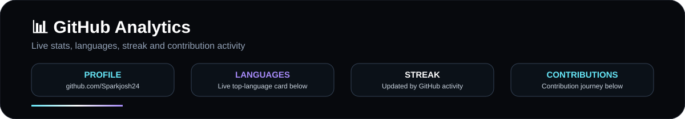
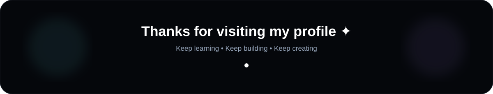

<!-- A.R. JOSHUA JEBERSON • AI & DATA SCIENCE -->

---

## 👋 About Me

> **AI & Data Science student who learns by building.**

I enjoy turning ideas into practical software and AI projects with <b>Python, machine learning and deep learning</b>. My work spans <b>computer vision, speech processing, backend APIs, data and security-related applications</b>.

🎓 <b>B.Tech — Artificial Intelligence & Data Science</b>  
📍 <b>Tamil Nadu, India</b>  
🎯 <b>Focus — AI • ML • Deep Learning • Python Development</b>

---

## ⚡ What I Build

<table width="100%"><tr><td width="50%" valign="top">

### 🤖 Artificial Intelligence
Machine learning and deep learning applications focused on practical problems.

### 👁️ Computer Vision
OpenCV-based image/video processing and visual AI experiments.

### 🎙️ Speech AI
MFCC-based audio features, LSTM/DNN models and speech emotion recognition.

</td><td width="50%" valign="top">

### 🐍 Python Engineering
Flask applications, REST APIs, automation and backend development.

### 🛡️ Security & Data
NVD CVE API integration and vulnerability-data processing.

### 📊 Data & SQL
Data handling, API-driven datasets and SQL fundamentals.

</td></tr></table>

---

## 🚀 Featured Work

<table width="100%">
<tr>
<td width="50%" valign="top">

### 🛡️ DEEPSHIELD
<b>Deepfake Detection System</b>

AI/deep-learning project focused on detecting manipulated media and exploring media authenticity.

<code>AI</code> <code>Deep Learning</code> <code>Computer Vision</code>

</td>
<td width="50%" valign="top">

### 🎙️ Speech Emotion Recognition
<b>Real-Time Speech AI</b>

Uses <b>MFCC + LSTM/DNN</b> with <b>RAVDESS & TESS</b> datasets for speech emotion recognition.

<code>Python</code> <code>LSTM</code> <code>MFCC</code> <code>Audio AI</code>

</td>
</tr>
<tr>
<td width="50%" valign="top">

### 📄 Question Paper Generator
<b>Flask Application</b>

A Python/Flask application for generating structured question papers.

<code>Python</code> <code>Flask</code> <code>REST</code>

</td>
<td width="50%" valign="top">

### 🔐 NVD CVE Project
<b>Vulnerability Data</b>

Retrieves and processes vulnerability information using the NVD CVE API.

<code>Python</code> <code>API</code> <code>Security</code>

</td>
</tr>
</table>

<b>➕ More Projects</b>

- <b>MCQ Generator</b> — multiple-choice question generation
- <b>Voice Short Answer App</b> — voice-based short-answer interaction
- <b>Meesho Clone</b> — e-commerce web development project
- <b>Snake Game</b> — Python game development

---

## 🧰 Tech Stack

---

## 📊 GitHub Analytics

---

## 🐍 Contribution Journey

---

## 🤝 Connect

<i>Open to learning, building and collaborating on meaningful AI & software projects.</i>

